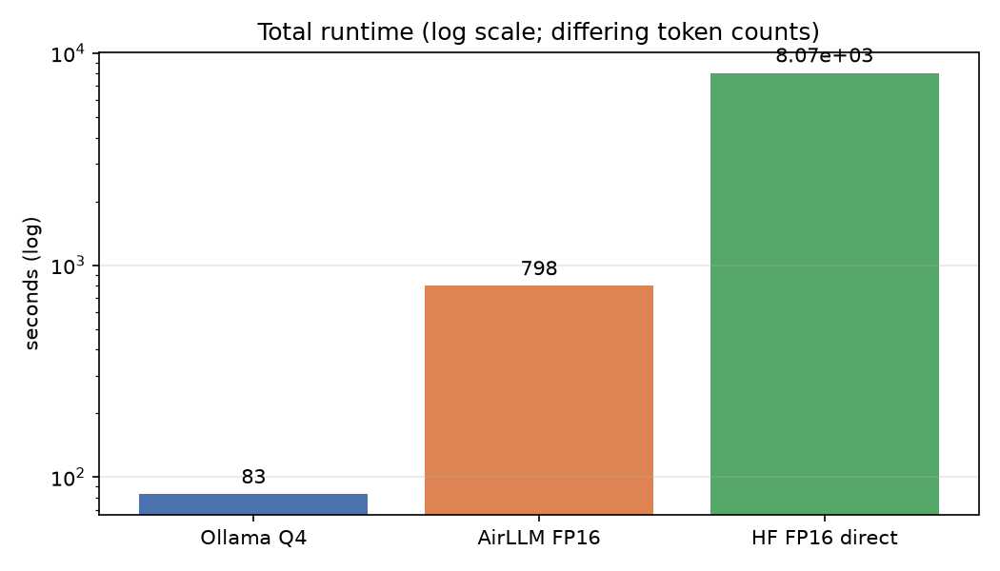
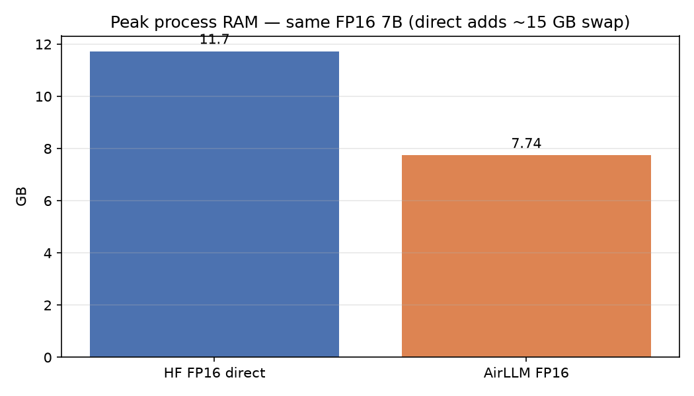
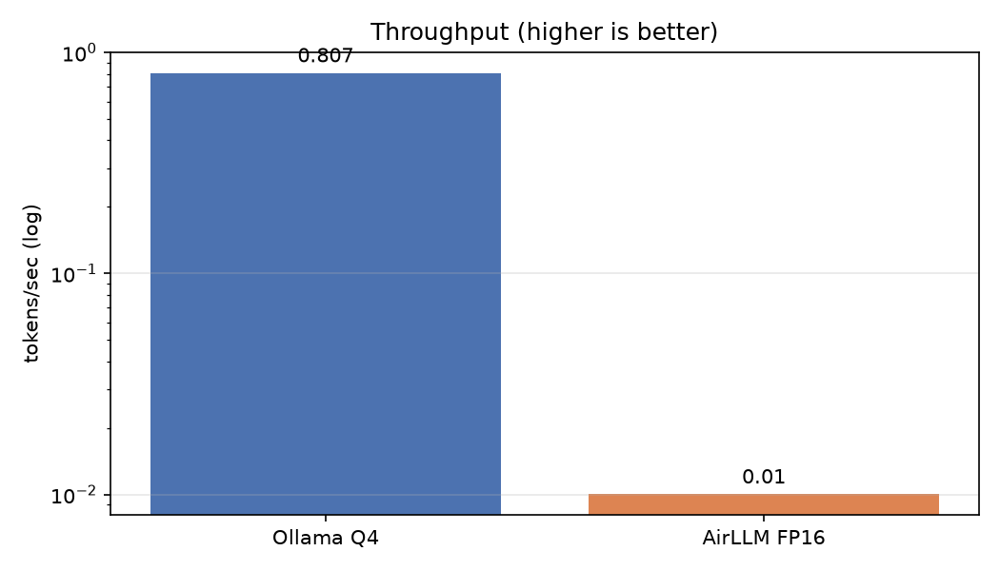
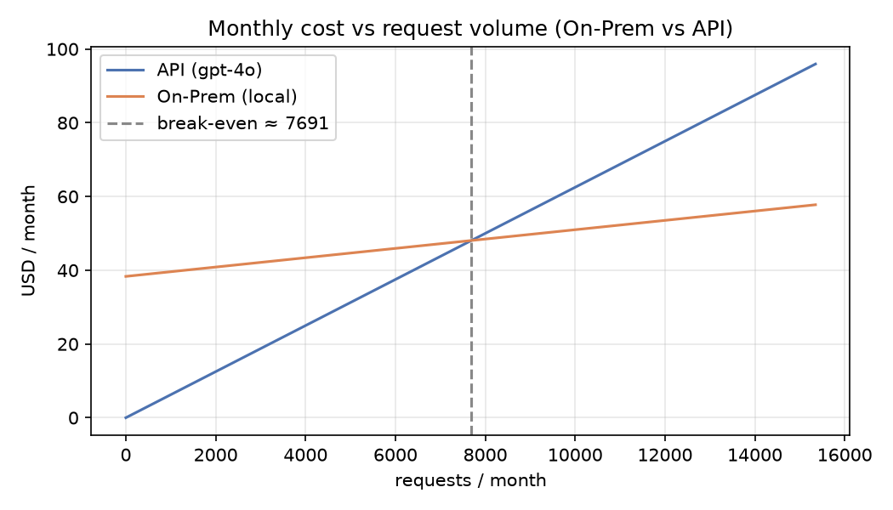
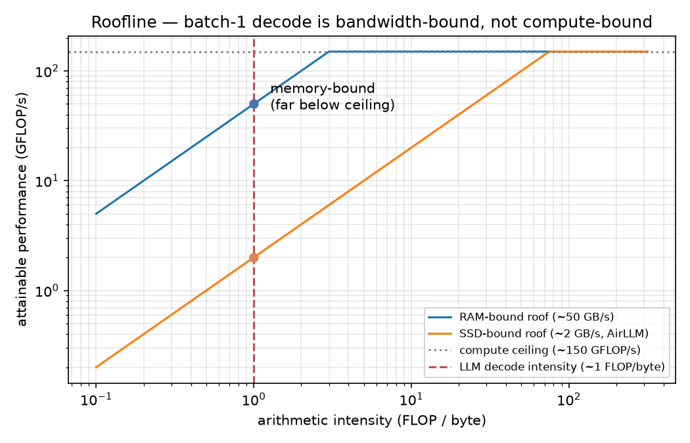

# Running a Massive LLM Locally — AirLLM, Quantization & Performance Benchmarking

> **EX05 deep-dive.** Take a language model that is *too big for RAM*, fail to run it the
> normal way, use **AirLLM layer-sharding + quantization** to run it anyway, **measure**
> everything rigorously, and work out **whether it's economically worth it** — explaining
> every result with inference theory.

This repository is the technical report *and* the reproducible harness behind it. The point is
**not** to run a model fast; it is to understand and quantify the bottlenecks of on-premises
LLM inference on constrained hardware. A negative result, well analyzed, is a result.

---

## TL;DR — what we found

- **The bottleneck is memory, not compute.** Loading the 7B in FP16 (~15 GB) into 15.7 GB of
  RAM didn't crash — it **thrashed swap for 2 h 14 min** to answer one prompt.
- **AirLLM makes it *fit*, not *fast*.** The same FP16 model ran at **7.74 GB peak, zero swap**
  via layer-by-layer paging — but **~79× slower** than a quantized in-memory engine.
- **Quantization is the highest-leverage knob** — ~Q4 is **~3.2× smaller** and **~79× faster**
  with no visible quality loss. But **bitsandbytes Q4/Q8 can't run here at all** (CUDA-only).
- **On-prem breaks even at ~7,700 requests/month** vs a hosted API — and only with a *fast*
  local engine; AirLLM FP16 at ~14 hours/request is never economic.

| Scenario | Fits in RAM? | Peak RAM | Speed | Total time |
|---|---|---|---|---|
| Ollama Q4 (optimised) | ✅ | ~4.7 GB model | **0.79 tok/s** | 55 s |
| **AirLLM FP16 (layer-sharded)** | ✅ *made to fit* | **7.74 GB, no swap** | 0.010 tok/s | 798 s / 8 tok |
| HF FP16 direct (naive) | ❌ | 11.7 GB **+ ~15 GB swap** | ~0.004 tok/s | **8,070 s (2 h 14 m)** |

---

## Setup & reproduction

> **You do not need to run any model to reproduce the analysis.** Every figure and table is
> regenerated from the saved records in `results/`. Re-running the models is optional and
> needs the heavy stack + a HuggingFace token.

### Prerequisites
- [`uv`](https://docs.astral.sh/uv/) — the only package manager used (no pip / venv).
- *Optional, only to re-run model experiments:* [Ollama](https://ollama.com), a free
  HuggingFace account + **read** token, and ~30 GB free disk.

### Install (base env — no torch, no token)
```bash
git clone https://github.com/swalha1999/airLLM-testing.git
cd airLLM-testing
uv python install 3.12
uv sync          # ruff, pytest, and the analysis deps (numpy/pandas/matplotlib)
```

### Reproduce the analysis & figures (base env, no models)
All of these read the committed records in `results/`:
```bash
uv run python experiments/consolidate_metrics.py    # the metrics table
uv run python experiments/compare_quantization.py   # FP16 vs ~Q4
uv run python experiments/assess_quality.py          # output-quality rubric
uv run python experiments/make_figures.py            # comparison charts -> figures/
uv run python experiments/break_even.py              # economics + break-even chart
uv run python experiments/sensitivity.py             # sensitivity extension
uv run python experiments/roofline.py                # roofline
```

### Run the quality gate
```bash
uv run python scripts/test_report.py        # pytest + coverage -> reports/test_report.md
uv run ruff check .                          # 0 violations
uv run python scripts/secret_scan.py         # no committed secrets
uv run python scripts/check_line_limit.py    # every .py file <= 150 code lines
```

### Re-run the model experiments (heavy — optional)
Only needed to regenerate raw results; the committed ones already cover everything. Requires
the `ml` extra (~4 GB: torch / airllm / bitsandbytes) and a token in `.env`:
```bash
uv sync --extra ml
cp .env-example .env          # then edit .env and set HF_TOKEN=hf_...
ollama pull qwen2.5:7b        # the baseline model
uv run --extra ml python experiments/baseline_ollama.py
uv run --extra ml python experiments/baseline_hf_direct.py   # ~2 h; deliberately exceeds RAM
uv run --extra ml python experiments/airllm_7b.py            # shards ~15 GB to C:\airllm_shards, slow
uv run --extra ml python experiments/bitsandbytes_check.py   # documents the CUDA-only failure
```
> ⚠️ `baseline_hf_direct.py` intentionally over-commits RAM and will make the machine sluggish
> for a couple of hours — that *is* the bottleneck being demonstrated.

### Configuration
All tunable values live in versioned `config/*.json` (no hard-coding) — change them and the
analysis recomputes:
- `setup.json` — model ids, shard path, prompts, run params.
- `costs.json` — API prices + hardware/electricity assumptions (drive the break-even).
- `rate_limits.json` — API gatekeeper limits.

---

## 1. The machine under test (FR-a)

| Resource | Value |
|---|---|
| CPU | Intel **i7-1195G7** — 4 cores / 8 threads |
| RAM | **15.7 GB** |
| GPU | NVIDIA **MX350 (2 GB)** + Intel Iris Xe — *torch is the CPU build; CUDA unused* |
| Disk | ~44 GB free at start (NVMe SSD) |
| OS / Python | Windows 11 / Python 3.12 |

This is intentionally a **memory-constrained laptop with no usable GPU** — the ideal stage for
the "model too big for RAM" problem the assignment is built around.

## 2. Model choice & justification (FR-a)

| Role | Model | Size | Why |
|---|---|---|---|
| **Main** | `Qwen/Qwen2.5-7B` (FP16) | **~15 GB** | Bigger than comfortable RAM (15 GB vs 15.7 GB) → forces the bottleneck. Capped at 7B because the FP16 download **plus** AirLLM's per-layer shards (~15 GB more) must fit on disk. |
| Baseline | `qwen2.5:7b` (Ollama, ~Q4 GGUF) | ~4.7 GB | The well-behaved, already-quantized reference run. |
| Smoke-test | `Qwen/Qwen2.5-0.5B` | ~1 GB | Validate the pipeline before scaling. |

Qwen2.5 was chosen because it's the assignment's recommended family and loads through the
generic `AutoModel` path, avoiding class-mismatch errors.

## 3. Method

A small **experiment harness** (`src/airllm_bench/`) measures every scenario *identically*:
a single **SDK** entry point runs a generation, a **measurer** times it (TTFT / TPOT /
throughput) and samples peak RAM/VRAM, and a **recorder** writes a versioned JSON record to
`results/`. All figures and tables regenerate from those records — no re-running models. The
harness has 100% test coverage and passes a CI gate (ruff, format, coverage ≥85%, secret scan,
150-line limit) on every push.

## 4. Baseline — characterising the bottleneck (FR-b)

Two baseline runs of the 7B (see `reports/phase3_baseline_findings.md`):

- **Ollama Q4 (it fits):** full answer in **55 s**, 0.79 tok/s. Clean.
- **HF FP16 direct (it doesn't fit):** loading ~15 GB into 15.7 GB RAM forced constant paging
  to the SSD. The four checkpoint shards loaded **progressively slower (83 → 117 → 162 → 195 s)**
  as RAM filled, and the whole run took **8,070 s ≈ 2 h 14 min** — **~146× slower** than the
  quantized run for the same answer. Task Manager during the run: **RAM 99% (238 MB free),
  Disk 100%, Committed 30.6 / 38.4 GB** (≈15 GB living in the page file), CPU 100%, **GPU idle**.

That is a textbook **memory-bound** bottleneck: the CPU was waiting on data, not computing.




## 5. AirLLM — making it fit (FR-c)

Run the *same* 7B through AirLLM, which loads **one transformer layer at a time** from disk
(see `reports/phase3_airllm_findings.md`):

- **Peak RAM 7.74 GB, zero swap** — Task Manager showed **50% RAM, 8 GB free, 21% disk**, a
  near-perfect inversion of the baseline.
- **0.010 tok/s (~100 s/token)** — AirLLM re-reads the whole model from disk *every token*, so
  it is **~79× slower** than the in-memory Q4 engine.

**AirLLM buys feasibility, not speed.** It turns the model from un-runnable into runnable by
keeping the working set tiny — the cost is latency.




> Two real dependency walls were hit and documented: AirLLM 2.11 needs `transformers<4.49`
> (optimum's BetterTransformer) **and** `transformers<4.43` (it predates the RoPE refactor that
> moved position embeddings to the model level). Pinned to `transformers==4.42.4`.

## 6. Quantization comparison (FR-c)

The planned FP16→Q8→Q4 sweep via AirLLM/bitsandbytes is **impossible here**: bitsandbytes
kernels are **CUDA-only** and abort with `Torch not compiled with CUDA enabled` (see
`reports/phase2_quantization_findings.md`). The CPU-viable comparison is therefore FP16
(AirLLM) vs ~Q4 (Ollama GGUF / llama.cpp):

| Regime | Disk | Throughput | Peak RAM |
|---|---|---|---|
| FP16 (AirLLM) | 15 GB | 0.010 tok/s | 7.74 GB |
| ~Q4 (Ollama GGUF) | **4.7 GB** | **0.794 tok/s** | (separate process) |

→ **~3.2× smaller, ~79× faster.** *Honest caveat:* this crosses two engines (AirLLM disk
streaming vs llama.cpp in-memory), so most of the speed gap is engine/IO, not precision alone —
we can't isolate precision because bitsandbytes won't run.



## 7. Consolidated metrics (FR-d)

| Scenario | Peak RAM (GB) | TTFT (s) | TPOT (ms) | Throughput (tok/s) | Runtime (s) |
|---|---|---|---|---|---|
| `baseline_ollama_q4` | 0.05* | 46.3 | 206 | **0.794** | 55 |
| `baseline_hf_direct_fp16` | **11.73** | N/A | N/A | N/A | **8070** |
| `airllm_7b_fp16` | 7.74 | N/A | N/A | 0.010 | 798 |

\* Ollama runs in its own process, so the in-process sampler doesn't see its RAM. N/A cells are
documented, not missing: the memory-focused runs captured peak RAM + runtime rather than
per-token timing (`reports/phase3_metrics_summary.md`).

## 8. Output quality (FR-d)

Across every regime that **ran** (FP16, ~Q4), output quality is **good and indistinguishable** —
both give coherent answers to the prompt. The **quality "red line" was not reached**: we have no
CPU-viable route below ~Q4 (bitsandbytes is gated), so we can't push precision low enough to
break quality. Conclusion: on this hardware, quantizing to ~Q4 is **effectively free in
quality** while paying back ~3.2× memory and ~79× speed (`reports/phase3_quality_assessment.md`).

## 9. Economics — On-Prem vs API (FR-e)

Two cost shapes: the API is pure variable cost; on-prem is mostly fixed (amortized hardware +
maintenance) plus tiny per-request electricity. With our assumptions
(`config/costs.json`, 500-in/500-out tokens, gpt-4o pricing):

| Quantity | Value |
|---|---|
| API (gpt-4o) | $0.00625 / request |
| On-prem fixed | $38.33 / month |
| On-prem electricity | $0.00127 / request |
| **Break-even** | **≈ 7,691 requests / month** |

Below ~7,700/month the API is cheaper; above it, on-prem wins — **but only with a fast local
engine** (Ollama Q4, ~10 min/request). AirLLM FP16 at ~14 hours/request is never economic. The
feasibility tool is *not* the economic tool. **Recommendation:** API for low/bursty volume or
latency-sensitive use; on-prem for high steady volume or when **data privacy/control** matters
(`reports/phase4_economics.md`).



## 10. Why it happens — concept analysis (FR-f)

- **Prefill vs Decode → TTFT vs TPOT:** the clean run's 46 s TTFT is dominated by one-time model
  *load*, not Prefill compute; 206 ms TPOT is steady Decode.
- **Memory-bound vs compute-bound:** every run was memory/IO-bound — CPU idled while disk pegged
  100%, and the ~79× quantization win proves the limit is *bytes moved*, not math. A
  roofline view places batch-1 decode (~1 FLOP/byte) far below the compute ceiling.
- **The paging analogy (the heart):** the naive baseline = **uncontrolled OS swap** (30.6 GB
  committed, thrashing); AirLLM = **manual, ordered layer paging** (one layer resident, 7.74 GB,
  no swap). Same disk-bound reality — chaotic vs controlled. Full discussion in
  `reports/phase4_concept_analysis.md`.



## 11. Extension — break-even sensitivity (FR-g)

An original one-at-a-time (OAT) **sensitivity analysis** turns the single break-even number into
a robustness statement. Varying each assumption 0.5×–2×: the decision is **strongly sensitive to
API price (inverse) and hardware CAPEX (direct), but barely to electricity**. Across realistic
variation the break-even stays in **~3,800–15,400 requests/month**
(`reports/phase4_extension_sensitivity.md`).


## 12. Research questions answered

1. **Bottleneck?** Memory capacity/bandwidth, not compute — shown by 99% RAM + 100% disk + idle
   GPU and the large quantization speed-up.
2. **How does AirLLM change allocation?** It pages layers one at a time → peak RAM tracks one
   layer (7.74 GB) instead of the whole model; it *is* manual virtual memory for NN layers.
3. **Quantization effect / red line?** ~3.2× memory, ~79× speed, no visible quality loss; red
   line not reachable (bitsandbytes is CUDA-gated).
4. **Prefill/Decode in TTFT/TPOT?** Visible in the Ollama run; TTFT dominated by load on
   constrained hardware.
5. **Price of running big on modest hardware?** Severe latency — 2 h 14 m naive, or feasible but
   ~100 s/token via AirLLM.
6. **Local vs API economics?** Break-even ~7,700 req/month, fast-engine-dependent; privacy can
   override price.

## 13. Repository map

| Path | What |
|---|---|
| `src/airllm_bench/` | The harness — SDK, runners, measurement, gatekeeper, analysis, cost model (100% tested) |
| `experiments/` | Run scripts for each scenario + the analysis/figure generators |
| `results/` | Raw versioned result records (see `results/README.md`) |
| `figures/` | Generated comparison charts (see `figures/README.md`) |
| `assets/` | Task Manager screenshots (baseline vs AirLLM) |
| `reports/` | Per-phase findings write-ups + the automated test report |
| `config/` | Versioned `setup.json`, `costs.json`, `rate_limits.json` |
| `docs/` | PRD / PLAN / TODO + dedicated mechanism PRDs |

Detailed findings live in `reports/`; this README is the integrated summary.
