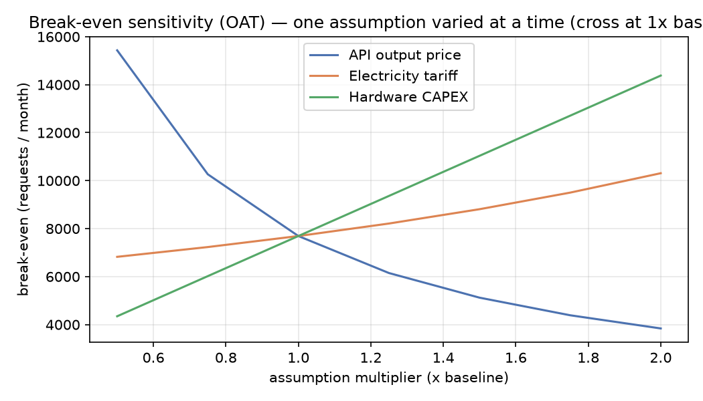

# Phase 4 — Original Extension: Break-Even Sensitivity Analysis (FR-g, #26)

**The extension:** a one-at-a-time (OAT) sensitivity analysis of the #23 break-even. The
single-point answer ("~7,691 requests/month") is only as trustworthy as its assumptions, so
this asks: **how much does the break-even move when each assumption is wrong?** (V3 §9.1.)

Method: vary each key input from **0.5× to 2× baseline**, recompute the break-even with the
tested cost model (`src/airllm_bench/services/costs.py`), and plot all three curves — they
all pass through the baseline point at 1× (~7,691). Steeper curve = more sensitive decision.

## Results

| Assumption | 0.5× | 1× (base) | 2× | Effect |
|---|---|---|---|---|
| **API output price** | 15,431 | **7,691** | 3,839 | **Strong, inverse** — pricier API → on-prem pays off much sooner |
| **Hardware CAPEX** | 4,347 | **7,691** | 14,379 | **Strong, direct** — costlier hardware → need more volume to justify it |
| **Electricity tariff** | 6,824 | **7,691** | 10,309 | **Weak** — only ±~30% across a 4× tariff swing |

(Recorded in `results/break_even_sensitivity_*.json`.)

## What it tells us

1. **The decision hinges on API price and hardware cost, not electricity.** Electricity is
   nearly flat because the per-request energy cost ($0.0013) is tiny next to the API
   per-request cost ($0.00625) — even doubling the tariff barely moves the line. So you can
   estimate electricity loosely without changing the conclusion.
2. **API price is the dominant lever (inverse).** If model prices fall (as they have
   historically), the break-even **rises** — on-prem needs ever-higher volume to compete. If
   prices rise, on-prem wins sooner. The on-prem case is strongest precisely when API prices
   are high and stable.
3. **Hardware cost scales the break-even almost linearly.** Cheaper/amortized-longer hardware
   directly lowers the volume needed to justify local — the most actionable on-prem lever.

## Why this is a meaningful extension

It turns a single fragile number into a **robustness statement**: across realistic ±2×
variation, the break-even stays in the **~3,800–15,400 requests/month** band and is governed
by API price and CAPEX. That is a far more honest input to a real "build vs buy" decision than
one point estimate — and it reuses the existing tested cost model rather than new ad-hoc math.

**Reproduce:** `uv run python experiments/sensitivity.py`
